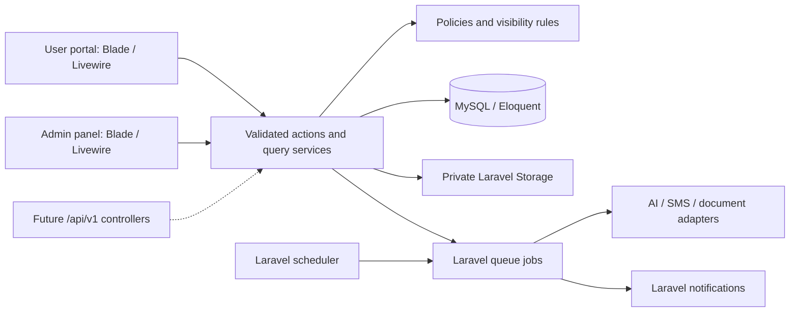

# AI Prompt Hub & Event Management Platform: proposed architecture

Status: **working architecture baseline; Phase 4 user and administration dashboards completed on 2026-09-01**. Later phases remain subject to their scope review. See the [Phase 4 report](phases/phase-04.md) for implementation and verification.

Read with [environment findings](ENVIRONMENT.md), the [database design](DATABASE.md), and the [implementation roadmap](ROADMAP.md). The complete application is the eventual destination; each phase is a separately verified increment.

## 1. Recommended baseline

| Area | Proposal | Rationale / verification |
| --- | --- | --- |
| Backend | Laravel `^13.0`, PHP 8.4 on a maintained patch | Installed PHP 8.4 is in Laravel 13's supported 8.3–8.5 range. Laravel 13 security support is listed through March 17, 2028. [Laravel releases](https://laravel.com/docs/13.x/releases) |
| UI | Blade, Livewire `^4.0`, Tailwind `^4.0`, Alpine provided by Livewire | One PHP-centered UI stack. Do not initialize Alpine twice. [Livewire installation](https://livewire.laravel.com/docs/4.x/installation), [Tailwind with Vite](https://tailwindcss.com/docs/installation/using-vite) |
| Data | MySQL 8.4 LTS, InnoDB, utf8mb4 | Native relational constraints; test against MySQL as well as running it locally. [MySQL release tracks](https://dev.mysql.com/doc/refman/8.4/en/mysql-releases.html) |
| Build | Node 22 on a maintained patch, npm, Vite + Laravel Vite plugin | Local 22.12.0 meets Vite's documented Node 22 minimum; resolve the actual plugin/engine combination at setup. [Vite](https://vite.dev/guide/) |
| Authentication | Laravel Fortify, custom localized Blade/Livewire screens | Reuse framework authentication flows while keeping UI and access rules under application control. [Fortify](https://laravel.com/docs/13.x/fortify) |
| Authorization | Spatie Laravel Permission 8.3 + Laravel policies | Dynamic role management with resource-level ownership and visibility checks. The installed package supports Laravel 12/13 and PHP 8.3+. [Package requirements](https://spatie.be/docs/laravel-permission/v8/prerequisites) |
| AI transport | Application-owned `AiGateway` contract; OpenAI Responses API via Laravel HTTP client | A small adapter controls request options, privacy, usage, error mapping, and HTTP fakes without coupling business logic to an SDK. |
| Background work | Laravel queues, scheduler, notifications | Database queue initially; dedicated production workers, shared cache, and Redis can be introduced when operational load warrants it. |

This table combines installed components with later targets. Phase 2 installed Fortify 1.39 and Socialite 5.30; Fortify's passkey/TOTP transitive dependencies are present but those features and routes remain disabled. Phase 3 installed Spatie Laravel Permission 8.3. Other feature packages remain deferred. See [identity conventions](IDENTITY.md), [authorization conventions](AUTHORIZATION.md), [foundation conventions](FOUNDATION.md), and the lockfiles.

## 2. Application shape

Use a **modular monolith**: one Laravel application and one MySQL database, grouped by business feature within normal Laravel directories. Do not introduce microservices, generic repositories, event sourcing, a second SPA frontend, or an artificial module loader.



Middleware enforces authentication, verification, account status, locale, and admin entry permission. Every action also authorizes the actor against current resource state. List/query services apply the same visibility predicates before pagination, counts, search, exports, calendar feeds, and dashboard aggregation. Policies alone do not filter collections.

Use `/app/*` for the user portal and `/admin/*` for administration, sharing one `users` table and one session guard. The admin area is a separate route group and layout, not a separate user population. Add `/api/v1/*` only when an API phase is requested. API controllers use the same actions, policies, validation rules, and transactions; no logic is tied to a Livewire lifecycle method.

## 3. Folder organization

This is a proposed tree, not directories to scaffold in advance. Add a class only when a phase needs it.

```text
app/
  Actions/{Identity,Prompts,Ai,BrandGuidelines,Events,Administration}/
  Contracts/{AiGateway,SmsGateway,DocumentExtractor,MalwareScanner,SearchProvider}.php
  Data/                         validated command/result objects where useful
  Enums/                        backed enums for stable states and visibility
  Http/Controllers/{Auth,Files,Api/V1}/
  Http/Requests/                HTTP input adapters using shared rule definitions
  Http/Resources/               introduced with public API endpoints
  Http/Middleware/
  Livewire/{Auth,Portal,Admin}/  thin state, validation and presentation adapters
  Models/                       conventional Eloquent models and relationships
  Policies/                     reusable ability and resource checks
  Queries/{Dashboard,Prompts,Events,Search,Analytics}/
  Services/{Ai,Documents,Storage,Identity}/
  Jobs/{Ai,Documents,Notifications,Maintenance}/
  Events/                       domain notifications after committed changes
  Listeners/
  Notifications/
  Providers/
config/                         typed non-secret configuration, env-backed secrets
database/{migrations,factories,seeders}/
lang/{en,ar}/                   auth, validation, navigation and feature translations
resources/views/{layouts,components,livewire}/
resources/css/app.css
resources/js/                   small calendar / clipboard / UI adapters
routes/{web,admin,console}.php   admin.php registered in normal bootstrap
routes/api.php                  only when the API phase is approved
tests/{Unit,Feature,Browser}/
docs/                           design, ADRs, phase reports, runbooks
```

An action such as `PublishPrompt`, `DisableUser`, or `UploadEventReport` is the transaction boundary: validate reusable rules, authorize, apply changes, write a safe audit/activity record, then schedule side effects after commit. External HTTP requests never run inside a long database transaction. Avoid adding action wrappers for trivial read-only model access.

## 4. Identity and authorization

### Account lifecycle

- Every account has a unique email and username; verified E.164 phone numbers are optional additional sign-in identifiers. Password can be absent for an OAuth-created account; adding one requires a verified recovery flow.
- Proposal for this internal platform: registration creates a `pending` account, requires email verification, and requires administrator approval before entering the portal. A verified email and `active` status are independent checks. An optional approved-domain restriction can be added; do not invent an organization's domain.
- Email/username plus password uses one normalized login field. Usernames cannot contain `@`, avoiding ambiguous matching. Use Laravel hashing and generic credential/recovery error responses.
- Google OAuth uses Socialite with state verification and minimal scopes. Provider identity is keyed by immutable provider subject. Never silently link an existing account based only on a matching email; require authenticated, recently verified linking. Only trust Google's verified email assertion under the configured provider contract. Never persist unused access/refresh tokens.
- SMS OTP initially signs into an existing account's verified number; it does not create phone-only accounts or bypass email/account approval. Enrollment and number replacement require recent authentication and independent verification. OTPs expire, are single-use, attempt-limited, and bound to purpose, challenge, and session. Store only a keyed verifier, never plaintext OTPs.
- All successful methods enter a shared finalization pipeline: check active status and verification, complete future MFA challenge if enabled, regenerate session, then grant access. Fortify is the extension point for future TOTP/recovery-code support. SMS login is not itself MFA.
- Disable/revoke actions invalidate existing sessions, remember-me access, future API tokens, and pending authentication challenges. Middleware rejects disabled users on every request, including Livewire updates; workers recheck before sensitive execution. Offer users a list of their own sessions and a revoke-other-sessions action.

### Permission policy

Roles aggregate granular capabilities; role names are never authorization logic. Seed the requested five roles. Add new roles through data, without code changes. Use one Spatie guard namespace so future Sanctum authentication does not require duplicate permission catalogs.

| Seed role | Implemented default responsibility |
| --- | --- |
| Super Administrator | All 18 current capabilities; protected assignment/revocation and last-active-super safeguards |
| Administrator | Every current capability except permission-catalog delegation |
| Content Manager | Prompt/category/publication/guideline preparation and AI use |
| Event Manager | Event management, event-file upload and AI use |
| Standard User | AI use when that later module becomes available |

The implemented catalog includes the 17 requested keys plus `access-admin`; role assignment uses `manage-roles`, and account approval uses the separate create/edit/disable capabilities. Later modules may split destructive or resource-specific abilities when their policy matrices require it. The exact current mapping is in AUTHORIZATION.md.

There is no blanket super-admin `Gate::before` that bypasses private-content policies. Administrative powers do not imply permission to read another user's conversations or private prompts. If a future support/legal access feature is needed, design an explicit audited capability and workflow separately. Never allow users to grant capabilities above their own delegation authority; reserved super-admin changes require a super administrator and recent authentication.

Resource visibility is `private`, `selected`, or `all_registered`. `selected` uses explicit user and role grant pivots; user grants OR role grants provide read access. Owner/assigned manager access is explicit in each policy. A visibility grant never grants edit or upload permission. Revocation takes effect in lists, search, files, AI jobs, and notification links. Draft library prompts/events are restricted to their authorized editors even when visibility is broad.

## 5. Feature boundaries

### Prompts and dashboard

Use one prompts table for personal and library prompts, with an explicit source and owner. Personal prompts start private; ordinary users cannot turn them into organization-wide publications by modifying Livewire state. Library publication requires `publish-prompts`. Favorites and uses are separate relations, not mutable counters on the prompt row. Category is singular initially; tags are many-to-many. Never evaluate user prompt text as Blade/PHP or arbitrary template code; support only an allowlisted variable syntax if the prompt phase needs variables.

The dashboard queries only authorized data and adds each summary when its module exists. Do not show fabricated counts or dead links for unbuilt modules. Recent means the user's activity; upcoming/recent events use timezone-aware dates and visibility scopes. Counts can be cached per user/access revision without exposing shared results across users.

### AI execution and history

Use the Responses API with application-owned MySQL history and `store: false` as the proposed baseline. Provider retention is a separate control: `store: false` does not by itself guarantee zero retention of all provider data. Review organizational data handling before sending internal documents. [OpenAI data controls](https://developers.openai.com/api/docs/guides/your-data).

For each send: validate actor, conversation ownership, allowed model, prompt visibility, context access, message size and quotas; atomically reserve budget and create one request plus ordered user message; dispatch a job after commit. Persist an idempotency key scoped to the user. The worker reloads current authorization and active context, records exact model/prompt/guideline versions, calls the provider, then atomically stores assistant output and usage and settles the reservation. Do not put secrets or full prompt content in queue payloads or logs.

One in-flight request per conversation prevents message ordering races. Use bounded input context, output limits, HTTP connect/read timeouts, bounded retries for safe failures, and a recoverable failed/unknown status. A timeout after provider acceptance can be ambiguous: do not blindly replay a chargeable request or claim exactly-once provider execution. Keep raw usage metadata for later accounting without double-counting retries.

Store display messages separately from any opaque provider continuation items required by the chosen model. Resend compatible prior input/output items when managing history locally; encrypt private continuation payloads and do not expose them as reasoning to users. [OpenAI conversation state](https://developers.openai.com/api/docs/guides/conversation-state).

Initial UI can poll authorized request state with accessible queued/running/completed/error states. Streaming or WebSockets are a later optimization, not a prerequisite. Rename/delete is owner-only; deletion cancels pending work where possible and suppresses late results. Model choices and role access are database configuration; actual API credentials and fixed allowed provider hosts are server-side environment configuration. Do not hardcode an unverified model name, price, or account entitlement.

### Brand guidelines and documents

Separate a logical guideline from immutable file versions. Each guideline can have at most one active version; multiple logical guidelines may be active. An admin-managed activation relation makes the selected version explicit and auditable. AI context includes only active, successfully scanned and extracted versions in a deterministic order, with bounded context size and recorded source/version references.

Uploads enter quarantine, then MIME/signature and size checks, malware scanning, text extraction, and optional image processing. Failed or unscanned files never become AI context or downloadable shared content. Start with extracted text and page/section chunks for PDF, DOCX, and text. Images are stored/versioned; OCR is a separate adapter and images must show that AI context is unavailable until OCR succeeds. Administrators can supply reviewed text when extraction is not possible.

`DocumentExtractor` and a future retrieval adapter isolate extraction and ranking. Chunks keep version, offsets/page references, extraction version and checksum; future embeddings can refer to stable chunk IDs in an external vector index. Do not switch away from MySQL or promise built-in vector indexing. No full RAG system, OCR service, or vector infrastructure is implemented merely to prepare for it.

### Events and workspace

The event core owns calendar ranges, status transitions, organizer, manager assignments, and audience. Calendar endpoints restrict time ranges and paginate list views. Start/end are UTC instants with an IANA event timezone. Monthly, weekly, and list views share one authorized query service; mobile defaults to a readable list with a view switcher.

Private means owner and explicitly authorized managers only. Attendance is distinct from visibility: adding an attendee does not silently publish a private event. For selected events, an assignment action can create the attendee and explicit access grant in one authorized transaction. Duplicating an event creates a private draft owned by the actor and does not copy attendees, audience grants, reports, or files unless a future explicit option is designed. Cancellation is a state change; deletion is a soft delete with audit.

Photos, designs, reports and other documents share private stored-file metadata. `event_files` associates a physical file with its event and collection. Photos add caption/order/dimensions, not a second binary storage system. Report records separate report type from immutable numbered versions. Communications have a stable event/type/language identity, editable drafts and saved revisions; regenerating with AI creates a new candidate and never silently overwrites approved/manual text. Arabic and English revisions remain independent.

Event communications are compose/save/copy functionality, not automatic email delivery or LinkedIn publishing. Any future send/publish integration needs its own explicit scope and authorization.

### Search, notifications, analytics and audit

Search dispatches to feature-specific query providers returning a common result shape. Start with authorized database queries; parameterize search input, allowlist sort/filter fields, bound result counts and scope private conversation search to its owner. MySQL full-text or a later external search engine is optional after Arabic search quality is evaluated. Document-content search only includes successfully extracted, authorized content. Never filter access after computing snippets, total counts or pagination.

Laravel database notifications are the initial delivery channel. Domain events after commit initiate notifications; scheduled reminders have persisted deduplication keys. Recheck recipients at delivery and linked-resource access on opening. Email, SMS, and push adapters can be added later; notification previews contain minimal sensitive content.

Analytics uses source facts: prompt uses, AI requests/usage, users' last activity and event records. Define active users as distinct active accounts with activity in the last 30 days by default; label that window. Report failed and completed AI requests separately; count token usage at the attempt source of truth. Aggregated daily rollups are added only when measured query cost justifies them. Administrative analytics must not include private conversation or prompt text.

Keep user-visible `event_activities` separate from restricted `audit_logs`. Write safe before/after metadata for sensitive changes in the same transaction. Never log credentials, OTPs, raw session tokens, full AI text, or private file contents. Logs are append-only through the application; production access controls and an external log sink provide stronger tamper resistance than an ordinary MySQL table alone.

## 6. Packages and infrastructure, introduced only when needed

| Phase | Dependency | Decision |
| --- | --- | --- |
| 1 | `laravel/framework`, `livewire/livewire`, `tailwindcss`, `@tailwindcss/vite`, `vite`, `laravel-vite-plugin` | Required foundation; compatible stable lockfile versions |
| 1 | `laravel/pint`, `phpunit/phpunit`, Laravel's standard test utilities | Formatting and automated tests; choose PHPUnit as the single PHP runner |
| 1 onward | `@playwright/test` | Browser flows and viewport regression tests against the local Laravel server |
| 2 | `laravel/fortify`, `laravel/socialite` | Installed authentication pipeline and Google OAuth adapter |
| 3 | `spatie/laravel-permission` | Installed dynamic RBAC with application policies and guarded actions |
| As needed | SMS provider SDK, only if its API requires it | Provider remains behind the Phase 2 gateway interface; no fabricated production delivery |
| 6 | PDF/DOCX extractor and image processor | Select maintained, licensed, sandboxable tools after real Arabic/English sample evaluation; PHP GD/Imagick prerequisite for chosen image path |
| 7 | Laravel HTTP client already included | No additional OpenAI PHP package required. First-party Laravel AI SDK may be reconsidered only if it demonstrably simplifies required privacy/state behavior |
| 8 | `@fullcalendar/core`, day-grid, time-grid, list, interaction packages | Standard calendar views, no premium resource scheduling required; lock matching versions after review. [FullCalendar docs](https://fullcalendar.io/docs) |
| 12 | `laravel/sanctum` | Install when versioned API authentication is actually introduced. [Sanctum](https://laravel.com/docs/13.x/sanctum) |
| As needed | Redis / Horizon, object storage Flysystem adapter, Scout | Optional operational upgrades, not initial required packages |

Use custom admin Blade/Livewire screens instead of a second administration framework. Laravel's official Livewire starter kit is an alternative scaffold, but it adds Flux UI; the default proposal is a plain Laravel skeleton plus Livewire and Fortify to keep the requested stack explicit. [Starter kit composition](https://laravel.com/docs/13.x/starter-kits).

## 7. Security and production controls

| Risk | Required control |
| --- | --- |
| Authentication attacks | Hash passwords; throttle by normalized identifier and IP; enumeration-safe responses; OTP expiry/attempt/resend limits; OAuth state validation; recent-auth checks for credential and privileged role changes |
| Stale access / IDOR | Current-state policies in HTTP/Livewire/actions/workers; deny disabled users; scope nested bindings and file parents; no trust in client-provided owner, role, status, path, token limits or visibility |
| Browser attacks | Framework CSRF middleware; escaped Blade text; sanitized Markdown/HTML with unsafe links removed; CSP compatible with the selected Livewire/Alpine setup; secure/HTTP-only/SameSite cookies in production |
| Unsafe files | Private storage outside public web root; randomized storage keys; extension plus MIME/signature and size validation; reject executable/SVG/HTML uploads initially; OOXML archive expansion limits; scanner fail-closed; safe download disposition and `nosniff`; authenticated previews/thumbnails |
| AI data exposure / abuse | Server-only key and provider allowlist; explicit approved context; treat document text as untrusted instructions; no arbitrary tool execution; model allowlist; atomic budget reservations; audit settings changes; privacy and retention review |
| Injection / overposting | Parameterized Eloquent queries; allowlisted sorts/filters and DTO fields; never execute user templates, shell expressions or file paths; validate server-side on every mutation |
| Lost updates / duplicates | DB transactions, unique constraints, row locks/version checks for sensitive state, after-commit jobs, deduplication keys, bounded retries and reconciliation |
| Operational failure | Worker supervision, scheduler single-run locks, health/readiness checks, failed-job alerts, request correlation IDs, safe logs, dependency audits, encrypted tested backups and documented restore procedure |

Production target is Linux with PHP-FPM/web server, MySQL, supervised workers and scheduler, HTTPS, `APP_DEBUG=false`, least-privilege database and storage access, and a secret manager or protected environment injection. `artisan serve` is for local verification. Apply a safe migration/rollback and backup procedure before deployment; do not call early phases production-ready as a whole.

## 8. Localization and responsive interaction

- All framework/UI labels and validation messages use `lang/en` and `lang/ar`. Database user content is not silently machine-translated. Category/role labels created by admins can have localized values where their phase needs them.
- Locale resolution: valid saved user preference, then valid session preference, then English fallback. Persist it for queued notifications. Set HTML `lang` and `dir`; support RTL using logical spacing and alignment, not a second fragile stylesheet.
- Use locale-aware date/number formatting with IANA timezones. Keep email, phone, URLs, and code readable with LTR isolation inside Arabic screens.
- Desktop uses a sidebar; tablet uses collapsible navigation; mobile uses a compact header/drawer, stacked forms, readable list/calendar alternatives, and accessible actions. Do not shrink dense desktop tables into unreadable grids.
- Verify focus order, keyboard operation, errors, touch targets, text zoom, contrast and reduced-motion behavior. Test real Arabic content and longer translations, not just flipped icons.

## 9. Decisions proposed for review

The architecture assumes one internal organization, not multi-tenant SaaS; pending-approval registration; email required on every account; phone OTP as linked-account login; private personal content even from administrators; private-by-default duplication; and no email/social publishing automation. These are explicit defaults the user may revise during design review.

Before the relevant integration phase, choose the Google client/domain policy, SMS provider/sender region, mail transport, allowed AI models and budgets, document size limits, retention/deletion periods, malware scanner, and hosting/backup arrangement. Do not block architecture review on collecting credentials; keep secrets out of this document.

Phase 1 implemented the framework foundation. Phase 2 implemented password, Google and SMS OTP authentication. Phase 3 implemented permission-protected user and role administration. Phase 4 added separate permission-aware portal and administration dashboards without creating business-module data. MFA and business modules remain deferred. Do not start another phase automatically.
