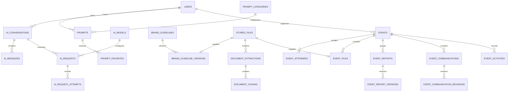

# Proposed normalized MySQL schema

Status: **design for review, not migrations**. Create only the tables needed by the approved implementation phase. This is a target logical schema; framework/package migration details are resolved against the locked versions when installed.

Phase 1 implemented only Laravel's user/password-reset/session/cache/queue baseline. No business-module tables have been created. See the [migration inventory and framework exceptions](phases/phase-01.md#database-changes) in the Phase 1 report; the remaining schema below is a future target.

## 1. Conventions and integrity

- MySQL 8.4, InnoDB, `utf8mb4`; use a documented Unicode collation consistently. Canonicalize email/username/phone inputs before uniqueness checks. Use exact/binary comparison for provider subjects, storage keys, hashes and other case-sensitive identifiers.
- Application entities use unsigned BIGINT primary keys and foreign keys. API identifiers need not be secret: authorization is mandatory even if opaque public IDs are later added. Use Laravel's required UUID/string keys for framework records such as notifications and sessions.
- Unless specified otherwise, entity rows have `created_at` and `updated_at`; immutable facts/revisions have `created_at` only. Store instants in UTC with microsecond precision where useful; event/user timezone is an IANA string. OTP expiry and atomic comparisons use one consistent clock.
- `?` means nullable. References below are real foreign keys unless explicitly called out as framework polymorphic exceptions. Index all foreign keys; do not add redundant indexes already covered by a leading composite key.
- `U(...)` denotes a unique constraint, `I(...)` a normal index. Composite uniqueness belongs in MySQL as well as application validation. Add reverse indexes to audience/favorite pivots for user/role-driven lookups.
- State/visibility fields use bounded VARCHAR values cast to PHP backed enums, validated at the action boundary and constrained with MySQL CHECKs where practical. Avoid native MySQL ENUM churn. Money, if introduced, uses integer minor units or DECIMAL, never float. Token counts use unsigned BIGINT.
- Soft delete users, prompts, categories, events, logical brand guidelines and event-file associations. Soft deletion does not trigger FK cascades; actions and queries enforce it. Versions and audit facts are immutable and are purged only by a documented retention operation.
- Delete policy: dependent pivots CASCADE on actual hard deletion; owned business records RESTRICT user hard deletion until reassigned or explicitly purged. Optional historical actor pointers SET NULL on approved hard deletion. Physical files are deleted by an after-commit cleanup job after checking remaining references, never by a database cascade alone.
- Lifecycle actions enforce cross-row rules with transactions and row locks. Their concurrency tests supplement constraints; examples include last-active-super-admin, budget reservation, event/file ownership and active guideline selection.

## 2. Identity, access and framework storage

| Table | Main columns | Constraints / lifecycle |
| --- | --- | --- |
| `users` | id; name; email; username; password?; phone_e164?; email_verified_at?; phone_verified_at?; status (`pending`, `active`, `disabled`); locale; timezone; last_seen_at?; disabled_at?; disabled_by? → users; remember_token?; timestamps; deleted_at? | U(email), U(username), U(phone_e164); I(status, last_seen_at). Phone nullable allows users without phones; only verified phone authenticates. Owner FKs elsewhere restrict hard deletion. Disable actor SET NULL. Later MFA fields follow Fortify's supported encrypted format. |
| `roles` | Package id; name; guard_name; optional display_name; timestamps | U(name, guard_name); seed machine names for the five requested roles, translate built-in labels; custom roles are data. Reserve super-admin role identity. |
| `permissions` | Package id; name; guard_name; timestamps | U(name, guard_name); permission keys are stable machine identifiers. |
| `role_has_permissions` | role_id → roles; permission_id → permissions | Composite PK; CASCADE both parents. |
| `model_has_roles` | role_id → roles; model_type; model_id | Spatie composite PK; role FK CASCADE; user relation is polymorphic (see exception below). |
| `model_has_permissions` | permission_id → permissions; model_type; model_id | Spatie composite PK; permission FK CASCADE. No direct grants in initial UI; retain supported package schema. |
| `social_accounts` | id; user_id → users; provider; provider_subject; timestamps | U(provider, provider_subject); U(user_id, provider) initially; CASCADE when a user is explicitly purged. No OAuth tokens stored for login-only integration. |
| `otp_challenges` | UUID id; user_id? → users; purpose; target_digest; encrypted_target?; code_verifier; session_binding_digest; attempts; expires_at; consumed_at?; invalidated_at?; last_sent_at?; created_at | I(target_digest, purpose, created_at), I(expires_at); keyed verifier and digest; encrypted destination retained only as needed. Consume with conditional update/lock; CASCADE user purge. Never expose user existence. |
| `sessions` | Laravel string id; user_id?; ip_address?; user_agent?; payload; last_activity | Standard database-session layout; I(user_id), I(last_activity). Application-managed user relation; session payload is private authentication material. |
| `password_reset_tokens` | email primary key; token; created_at? | Framework-managed hashed token, expiry and throttling; no second custom reset-token table. |
| `jobs`, `job_batches`, `failed_jobs` | Framework queue structures | Use Laravel's generated schemas and indexes; payloads carry IDs, not secrets or full documents. Retention cleanup required. |
| `cache`, `cache_locks` | Framework database-cache structures | Used initially for rate limits and atomic locks; shared Redis may replace these operationally. |
| `personal_access_tokens` | Sanctum's supported tokenable relation, name, hash, abilities, last_used_at, expires_at | **Future API phase only**; hashed tokens, scoped abilities, revocation and expiration. |

Spatie's user-assignment tables and Laravel's session/notification/token structures have polymorphic or deliberately unconstrained user references. Do not pretend these have database-enforced user FKs. Initially only `User` may be an authorization subject; use a fixed morph map, validate assignments server-side, prohibit arbitrary model_type inputs, and explicitly clean up memberships/sessions/tokens on user purge. Preserve package compatibility instead of modifying its generic relation shape without an ADR. Ordinary business tables below use typed FKs.

Username is a canonical unique login string without `@`; email is always required for this proposed first version. A phone is optional and must be E.164 with independently tracked verification. Nullable password allows a linked-provider account without a local password. Registration approval and contact verification remain independent states.

## 3. Prompt library and personal prompt management

| Table | Main columns | Constraints / lifecycle |
| --- | --- | --- |
| `prompt_categories` | id; slug; name; description?; sort_order; is_active; created_by? → users; timestamps; deleted_at? | U(slug); I(is_active, sort_order); actor SET NULL. Required category labels can use `prompt_category_translations` below. Archive referenced categories or reassign before hard deletion. |
| `prompt_category_translations` | category_id → prompt_categories; locale; name; description? | Composite PK(category_id, locale); CHECK locale in en/ar initially; CASCADE category hard deletion. Base name is the fallback. |
| `prompts` | id; owner_id → users; category_id? → prompt_categories; source (`personal`, `library`); title; description?; content LONGTEXT; content_locale?; visibility; status (`draft`, `published`, `archived`); published_at?; published_by? → users; revision_number; timestamps; deleted_at? | I(source, status, visibility, category_id), I(owner_id, updated_at), I(status, published_at); owner RESTRICT, optional publisher SET NULL; category RESTRICT until reassigned. Revision number supports stale-edit detection. |
| `prompt_user_access` | prompt_id → prompts; user_id → users; granted_by? → users; created_at | PK(prompt_id, user_id); I(user_id, prompt_id); pivot parents CASCADE, grant actor SET NULL. |
| `prompt_role_access` | prompt_id → prompts; role_id → roles; granted_by? → users; created_at | PK(prompt_id, role_id); I(role_id, prompt_id); same rules. |
| `tags` | id; canonical_name; display_name; timestamps | U(canonical_name). Do not expose global tag suggestions/counts originating only in inaccessible personal prompts. |
| `prompt_tag` | prompt_id → prompts; tag_id → tags | Composite PK; CASCADE both parents; reverse index on tag_id. |
| `prompt_favorites` | user_id → users; prompt_id → prompts; created_at | PK(user_id, prompt_id); I(prompt_id); CASCADE hard deletion; inaccessible favorites are excluded from responses. |
| `prompt_uses` | id; user_id? → users; prompt_id? → prompts; ai_request_id? → ai_requests (added in AI phase); kind (`copy`, `ai`); client_operation_id; created_at | U(user_id, client_operation_id); I(user_id, created_at), I(prompt_id, kind, created_at); optional historical pointers SET NULL. An AI submission creates one logical use, not one use per retry. |

Library prompts are visible/useable to their selected audience only when published. Authorized editors can preview drafts. Owners can use their own private drafts. Standard users' personal prompts stay private; publishing them to the library requires an explicit authorized action rather than a source/visibility field update from the browser.

Favorite count derives from `prompt_favorites`. Usage count is the count of logical AI uses; show copy count separately if desired. Recently used prompts come from `prompt_uses`. Avoid storing redundant counters initially. AI execution snapshots the actual prompt content and revision in its request, so later edits do not rewrite past conversation meaning.

## 4. Physical storage, extraction and guideline versions

| Table | Main columns | Constraints / lifecycle |
| --- | --- | --- |
| `stored_files` | id; uploaded_by? → users; disk; storage_key; original_name; mime_type; extension; size_bytes; sha256; state (`pending`, `quarantined`, `ready`, `rejected`, `deleting`); scan_status; scanned_at?; scan_engine_version?; failure_code?; timestamps | U(disk, storage_key); I(state, created_at); actor SET NULL. Private disks only. Do not make checksum globally unique: equal content does not imply equal ownership/access. |
| `document_extractions` | id; stored_file_id → stored_files; extractor; extractor_version; status (`pending`, `running`, `ready`, `failed`); language?; error_code?; completed_at?; timestamps | U(stored_file_id, extractor, extractor_version); I(status, created_at); CASCADE explicit file-metadata purge after references cleared. Text lives in chunks rather than duplicated in this row. |
| `document_chunks` | id; extraction_id → document_extractions; ordinal; text LONGTEXT; page_start?; page_end?; section_label?; offset_start?; offset_end?; token_estimate?; content_hash; created_at | U(extraction_id, ordinal); CASCADE extraction purge. Content is private and subject to parent authorization. Stable IDs can be used by a future vector index. |
| `brand_guidelines` | id; title; description?; created_by? → users; timestamps; deleted_at? | I(deleted_at, updated_at); creator SET NULL. Logical identity persists across versions. |
| `brand_guideline_versions` | id; brand_guideline_id → brand_guidelines; stored_file_id → stored_files; version_number; version_label?; notes?; uploaded_by? → users; created_at | U(brand_guideline_id, version_number); U(brand_guideline_id, id) for activation FK; U(stored_file_id); guideline/file RESTRICT until explicit version purge; uploader SET NULL. Immutable original file. |
| `brand_guideline_activations` | brand_guideline_id primary key → brand_guidelines; version_id; activated_by? → users; activated_at | Composite FK(brand_guideline_id, version_id) → brand_guideline_versions(brand_guideline_id, id), RESTRICT; actor SET NULL. One row per active logical guideline, no row means inactive. |

Activation locks the logical guideline, validates the version belongs to it, and checks scanner/extraction readiness before setting the activation row. Version replacement creates a new version; it never overwrites an existing object. An image can be retained without OCR, but cannot contribute textual AI context until a reviewed extraction exists. The admin UI must make this distinction visible.

Storage metadata records do not confer access. Downloads resolve a authorized parent guideline/event association, then authorize the requested file. They do not accept an arbitrary disk/path supplied by the client. Binary content stays in Laravel Storage, including derivatives such as thumbnails. Any derivative records added in the photo phase point back to the original and inherit access.

Future optional `chunk_embeddings` may hold chunk ID, provider/model, dimensions, index namespace, external vector reference and indexed hash; create it only when RAG is approved. Do not add fake vector columns or upload documents to a provider merely as preparation.

## 5. AI model configuration, conversations and usage

| Table | Main columns | Constraints / lifecycle |
| --- | --- | --- |
| `ai_models` | id; provider; provider_model_id; display_name; is_enabled; context_token_limit; max_output_tokens; capabilities JSON; timestamps | U(provider, provider_model_id); capability JSON is bounded configuration, not relationships. Disable referenced models; RESTRICT historical deletion. |
| `ai_settings` | singleton id; default_model_id? → ai_models; is_enabled; timestamps | CHECK id = 1; FK RESTRICT; no secrets. Default must be enabled; user must also have access to it. |
| `ai_model_role` | ai_model_id → ai_models; role_id → roles; created_at | Composite PK; reverse role index; CASCADE actual parent deletion when allowed. Model access is an explicit allowlist. |
| `role_ai_limits` | role_id primary key → roles; enabled; daily_request_limit; daily_token_limit; max_input_tokens; max_output_tokens; timestamps | Role FK CASCADE; nonnegative checks; no implicit unlimited value. Permission `use-ai` is still required. |
| `ai_conversations` | id; user_id → users; title; ai_model_id → ai_models; last_message_at?; timestamps; deleted_at? | I(user_id, updated_at), I(user_id, last_message_at); owner/model RESTRICT. Conversation default model is not necessarily every message's model. |
| `ai_requests` | id; user_id? → users; conversation_id? → ai_conversations; event_communication_id? → event_communications (added in Phase 10); ai_model_id → ai_models; prompt_id? → prompts; idempotency_key; status (`queued`, `running`, `completed`, `failed`, `unknown`, `cancelled`); purpose (`assistant`, `event_communication`); prompt_revision?; encrypted_prompt_snapshot?; encrypted_input_payload?; context_message_cutoff?; reserved_tokens; usage_date; settings_snapshot JSON; failure_code?; queued_at; started_at?; finished_at?; created_at | U(user_id, idempotency_key); I(conversation_id, created_at), I(user_id, created_at), I(status, queued_at). User/prompt/conversation/communication may SET NULL only on controlled purge; model RESTRICT. Content snapshots follow private-content retention; settings JSON contains only safe options. |
| `ai_messages` | id; conversation_id → ai_conversations; ai_request_id? → ai_requests; sequence; role (`user`, `assistant`, `system`, `tool`); content LONGTEXT; status; created_at | U(conversation_id, sequence); I(ai_request_id); conversation CASCADE at explicit purge; request SET NULL only during coordinated cleanup. Initially emit only needed roles. Browser cannot insert system/tool messages. |
| `ai_request_attempts` | id; ai_request_id → ai_requests; attempt_number; provider_request_id?; provider_response_id?; status; input_tokens?; cached_input_tokens?; output_tokens?; total_tokens?; usage_metadata JSON?; duration_ms?; safe_error_code?; started_at; finished_at? | U(ai_request_id, attempt_number); I(provider_request_id); request CASCADE only after retention policy; nullable usage means unknown, not zero. Source of truth for provider usage/billing facts. |
| `ai_response_items` | id; ai_request_id → ai_requests; ordinal; item_type; encrypted_payload LONGTEXT; created_at | U(ai_request_id, ordinal); request CASCADE on authorized content purge. Only retained if required for compatible multi-turn continuation; hidden from ordinary responses/logs. |
| `ai_request_brand_versions` | ai_request_id → ai_requests; brand_guideline_version_id → brand_guideline_versions; context_order; created_at | Composite PK; request CASCADE, version RESTRICT while referenced. Records exactly which immutable versions supplied context. |
| `ai_request_context_chunks` | ai_request_id; brand_guideline_version_id; document_chunk_id → document_chunks; ordinal; included_text_hash; created_at | PK(ai_request_id, document_chunk_id); composite FK(request, version) to ai_request_brand_versions; chunk RESTRICT while retained. Action verifies extraction's file matches that version. |
| `ai_usage_buckets` | user_id → users; usage_date UTC DATE; reserved_requests; charged_requests; reserved_tokens; charged_tokens; updated_at | PK(user_id, usage_date); nonnegative checks; row lock for quota reservations/settlements; CASCADE user purge. Derived enforcement cache, reconciled from request/attempt ledger. |

For users with multiple roles, permissions and model grants are unions. Among enabled roles granting the requested model, take the highest allowed per-request input/output limit, capped by model limits. The user's daily request/token budget is the highest enabled role budget across their roles, shared across all models; adding another model does not multiply the budget. Setting a lower limit blocks new work when existing usage exceeds it. Quota limits and the global feature flag are rechecked when the queued job starts.

Reservations are conservative estimates of bounded input plus permitted output. Completed/known-billed usage settles the bucket once; definitive unaccepted failures release it; ambiguous provider acceptance retains a reservation until reconciled or handled by a documented conservative policy. Retries cannot be assumed free. Idempotent settlement and attempt records prevent double counting. An atomic per-conversation lock plus active-request checks serializes sends; lock expiry alone must not allow a duplicate provider call.

Token usage belongs to attempts rather than being copied onto every message, preventing double counting. Optional message usage in an API resource can be derived. Cached/reasoning usage details remain in the safe usage metadata; avoid adding fields based on an assumed provider response that has not been verified.

Live requests require a real actor and an authorized purpose-specific target: assistant requests belong to their owner's conversation; communication requests belong to the referenced event communication and are checked through its event policy. The worker reloads these typed targets rather than trusting IDs hidden in JSON. Nullable historical pointers support controlled purges, not anonymous execution. Input payloads provide immutable private generation inputs when there is no conversation message, and are never copied to general settings or logs.

## 6. Events, attendees and visibility

| Table | Main columns | Constraints / lifecycle |
| --- | --- | --- |
| `event_categories` | id; slug; name; description?; sort_order; is_active; timestamps; deleted_at? | U(slug); I(is_active, sort_order); category removal requires reassignment. Add locale rows analogous to prompt categories when needed. |
| `events` | id; organizer_id → users; category_id? → event_categories; title; description?; location?; starts_at; ends_at; timezone; status (`draft`, `planned`, `confirmed`, `in_progress`, `completed`, `cancelled`); visibility; cancelled_at?; cancelled_by? → users; cancellation_reason?; revision_number; timestamps; deleted_at? | CHECK ends_at > starts_at; I(starts_at, ends_at), I(status, starts_at), I(organizer_id, starts_at), I(category_id, starts_at); organizer/category RESTRICT; optional actor SET NULL. |
| `event_managers` | event_id → events; user_id → users; assigned_by? → users; created_at | PK(event_id, user_id); I(user_id, event_id); parents CASCADE; actor SET NULL. Scope grants management only in combination with relevant permissions. |
| `event_attendees` | id; event_id → events; user_id → users; attendance_status (`assigned`, `accepted`, `declined`, `attended`); assigned_by? → users; assigned_at; responded_at?; timestamps | U(event_id, user_id); I(user_id, event_id); parents CASCADE at approved hard delete; actor SET NULL. Attendance is not an access grant. |
| `event_user_access` | event_id → events; user_id → users; granted_by? → users; created_at | Composite PK and reverse index; parents CASCADE; actor SET NULL. |
| `event_role_access` | event_id → events; role_id → roles; granted_by? → users; created_at | Composite PK and reverse index; parents CASCADE; actor SET NULL. |

Initially the organizer is an internal user. External contacts, recurring events, ticketing, resource scheduling, public anonymous events and invitations to non-users are outside the requested first version. Event date and start/end display times derive from UTC instants and timezone, avoiding duplicate date/time truth. Multi-day events work with the same interval model.

Transitions: draft → planned/confirmed; planned → confirmed; confirmed → in_progress; in_progress → completed; nonterminal states → cancelled. Authorized correction/reopening of completed/cancelled records, if required, needs its own explicit audited action rather than arbitrary status assignment. Draft and deleted events are never exposed in normal calendar feeds. Range overlap is `starts_at < range_end AND ends_at > range_start`, with bounded range lengths and half-open interval semantics.

## 7. Event files, reports, communications and activity

| Table | Main columns | Constraints / lifecycle |
| --- | --- | --- |
| `event_files` | id; event_id → events; stored_file_id → stored_files; collection (`photos`, `pre_event_reports`, `post_event_reports`, `communications`, `designs`, `other_documents`); caption?; sort_order; image_width?; image_height?; timestamps; deleted_at? | U(stored_file_id); U(event_id, id) for scoped FKs; I(event_id, collection, created_at), I(event_id, collection, sort_order); event/file RESTRICT before coordinated purge. Photo gallery is this table filtered by collection, not duplicate photo storage. |
| `event_reports` | id; event_id → events; type (`pre_event`, `post_event`); title?; created_by? → users; timestamps | U(event_id, type); U(event_id, id); event RESTRICT until explicit workspace purge; creator SET NULL. One logical report of each type; versions below. |
| `event_report_versions` | id; event_id; event_report_id; event_file_id; version_number; notes?; uploaded_by? → users; created_at | U(event_report_id, version_number); U(event_file_id); composite FK(event_id, event_report_id) → event_reports(event_id, id); composite FK(event_id, event_file_id) → event_files(event_id, id); RESTRICT both; actor SET NULL. |
| `event_communications` | id; event_id → events; type (`internal_email`, `linkedin_post`, `general_copy`); locale (`ar`, `en`); draft_subject?; draft_body LONGTEXT?; status (`draft`, `ready`); revision_number; updated_by? → users; timestamps | U(event_id, type, locale); I(event_id, status); event RESTRICT until explicit purge; editor SET NULL. No external-send status because delivery is not in scope. |
| `event_communication_revisions` | id; event_communication_id → event_communications; version_number; subject?; body LONGTEXT; origin (`manual`, `ai`); ai_request_id? → ai_requests; created_by? → users; created_at | U(event_communication_id, version_number); communication RESTRICT while versions retained; AI/actor SET NULL during controlled retention purge. Saved snapshots are immutable. |
| `event_activities` | id; event_id → events; actor_id? → users; action; event_file_id? → event_files; event_communication_id? → event_communications; changes JSON; created_at | I(event_id, created_at); event RESTRICT pending retention purge; optional subjects/actor SET NULL. Use explicit file-to-event validation and reject cross-event references; safe redacted changes only. |

Report uploads must match logical report type and file collection as well as the composite event FK; enforce this in the report-upload action. Reports support PDF, DOCX, XLSX with a documented size limit. Replacing a report creates a new stored file and incremented version in a locked transaction. No mutable `latest_version_id` is needed: latest is the highest version number.

Gallery uploads support multiple files, but each is individually validated/scanned and returns a clear success/failure result. Thumbnail access follows original-file authorization. Any album/folder feature beyond named collections should add a typed event-owned parent relation when requested rather than storing arbitrary client filesystem paths.

## 8. Notifications, audit and non-secret settings

| Table | Main columns | Constraints / lifecycle |
| --- | --- | --- |
| `notifications` | Laravel UUID id; type; notifiable_type; notifiable_id; data JSON; read_at?; timestamps | Framework morph index; user-only notifiable initially; explicit purge handling. Payload contains translated/minimal resource references, not private text previews. |
| `notification_deliveries` | id; event_id? → events; recipient_id → users; notification_type; channel; deduplication_key; status; scheduled_at?; delivered_at?; safe_error_code?; timestamps | U(deduplication_key, recipient_id, channel); I(status, scheduled_at); user CASCADE, event SET NULL at purge. Add in notification phase to make retries/reminders observable and idempotent. |
| `audit_logs` | id; actor_id? → users; action; subject_type; subject_id?; correlation_id?; before JSON?; after JSON?; redacted_metadata JSON?; created_at | I(subject_type, subject_id, created_at), I(actor_id, created_at), I(action, created_at); actor SET NULL. Subject is a deliberate immutable descriptive reference without FK so deletion does not erase audit identity. Fixed subject-type allowlist. |
| `system_settings` | id; group; key; value JSON; value_type; updated_by? → users; timestamps | U(group, key); actor SET NULL; known setting keys and schemas only. No arbitrary class names, provider URLs, executable expressions, credentials or duplicated AI relational settings. |

The event activity stream is restricted to the event's current audience. Administrative audit is separately permissioned and retains evidence of deleted resources. Append-only is enforced by application write paths and production DB privileges; absolute tamper-proofing is not claimed.

Notification deduplication must include the event occurrence/version and reminder offset where applicable, so rescheduling does not suppress new valid reminders or resend stale ones. Jobs recheck event status, current date/time and recipient access before delivery. Database notification insertion and delivery marking share a transaction where possible.

Search needs no universal table initially. Analytics needs no speculative warehouse or counters initially. Feature-specific queries and the usage facts above cover the initial metrics; later indexed rollups can be rebuilt from facts.

## 9. Simplified relationship map

This diagram omits most access pivots and nullable audit references; the tables above are authoritative. Files are created for one intended parent use; cross-parent sharing is not an initial feature. If sharing is later introduced, cleanup must consider every reference and no access may be inferred from shared bytes.

## 10. Migration order and retention decisions

1. Foundation: framework user/session/password-reset, cache and queue migrations only as required by the selected scaffold.
2. Identity: user profile/status/identifier additions, Spatie roles/permissions; audit_logs with the first sensitive actions. Social identities/OTP come with their own later phase.
3. Prompts: categories/translations, prompts, audiences, tags, favorites and uses. Add the nullable AI request relation only after its target exists.
4. Documents: stored files, extractions/chunks, logical guidelines, versions, then activation relation.
5. AI: models/settings/role grants and limits, conversations, requests, messages, attempts, continuation items, context joins and quota buckets.
6. Events: categories/events, typed access and assignment pivots, then workspace files/reports/communications/activity as their phases arrive. Add nullable activity subject FKs with their target modules, and the AI request communication FK after the communications table exists.
7. Notifications and remaining settings when needed; Sanctum only with approved API work.

Down migrations reverse dependency order; run rollback tests only on a disposable test database. Use additive changes and explicit data backfills on deployed databases; never run `migrate:fresh` on user data.

Retention periods are a review item before deployment: password/OTP/session expiry, failed jobs, AI content and snapshots, orphan uploads, event records, audit facts and backups need documented windows. Soft deletion is reversible hiding, not erasure. Hard-purge actions must cancel pending jobs, remove private content/continuation/context references and physical objects, invalidate search/vector indexes if present, and preserve only the agreed anonymized usage/audit facts. Default to retaining owned records until this policy is agreed rather than silently cascading their deletion.
